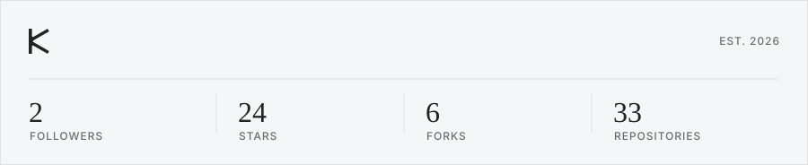
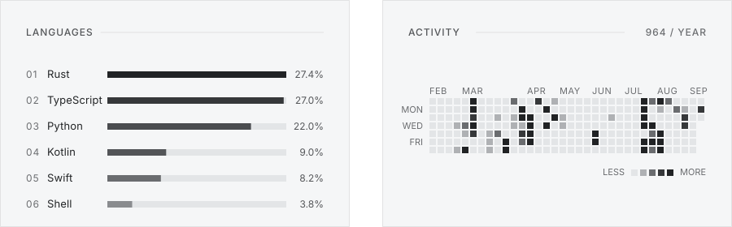
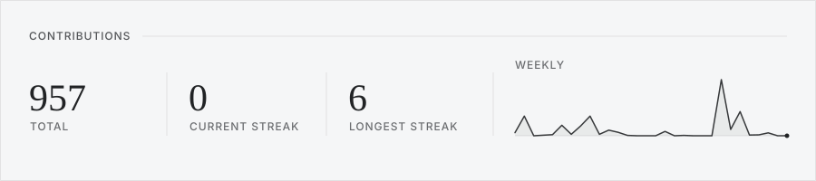

  

  

<!--
  Plain-text mirror of the stat cards above.
  Kept in sync by build_readme.py and readable when images don't load.
-->

Plain-text stats

<!-- github_stats starts -->2 followers · 23 stars · 7 forks · 33 repos<!-- github_stats ends -->

**Languages**

<!-- languages starts -->
• **Python** — 47.0%
• **Rust** — 29.3%
• **TypeScript** — 13.4%
• **Kotlin** — 7.5%
• **Swift** — 1.3%
• **Shell** — 0.6%
<!-- languages ends -->

**Recent Releases**

<!-- recent_releases starts -->
• No recent releases
<!-- recent_releases ends -->

Monochrome stat cards, generated on GitHub Actions and refreshed every six hours. The whole thing lives on GitHub — read it, fork it, self-host it.

